# LMS-platform Frontend

Frontend for **InnovaLearn**, an LMS platform currently in development for accessible online education.

Built with modern web technologies to provide an intuitive and responsive experience for both students and teachers.

---

# 📸 Preview


Dashboard for admins:
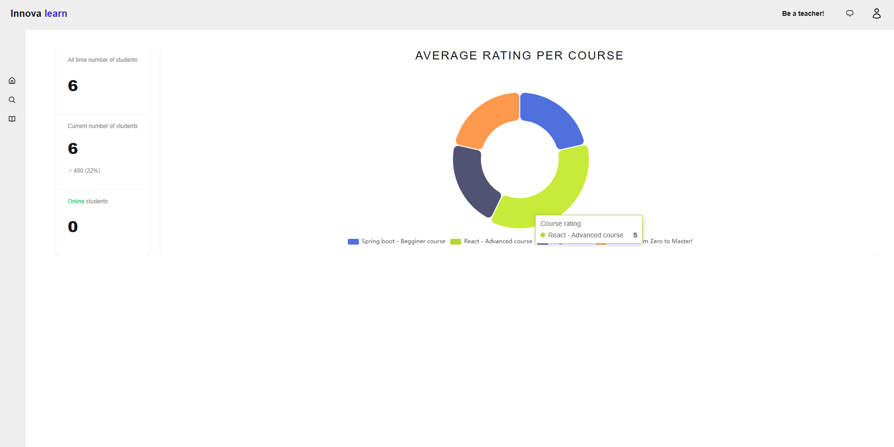
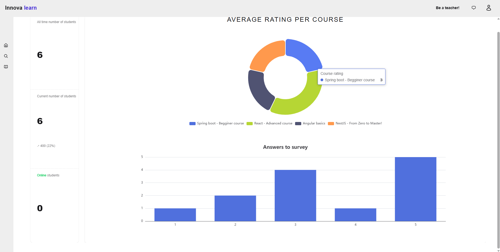
Course creation and management:
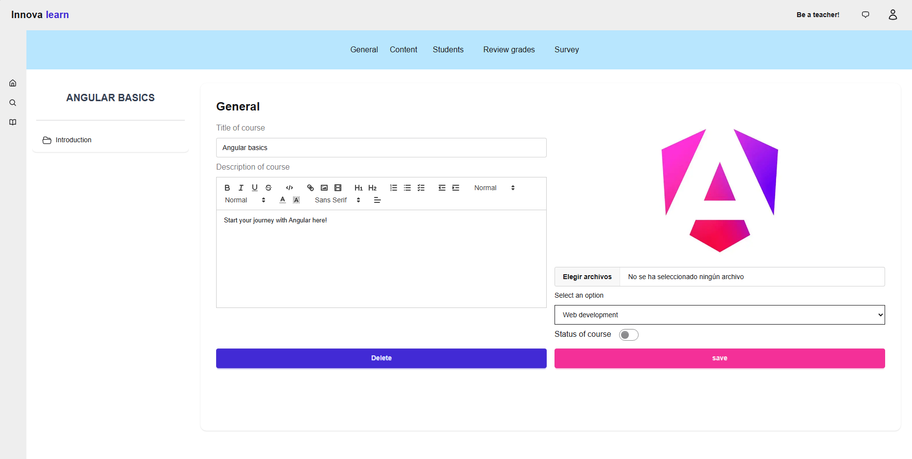
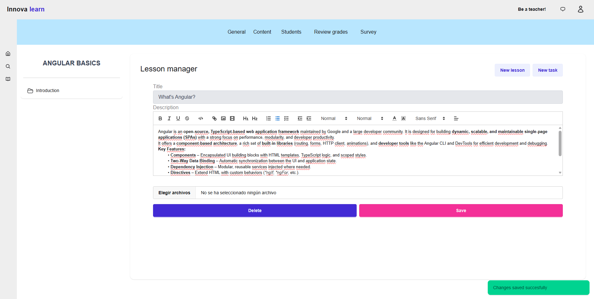
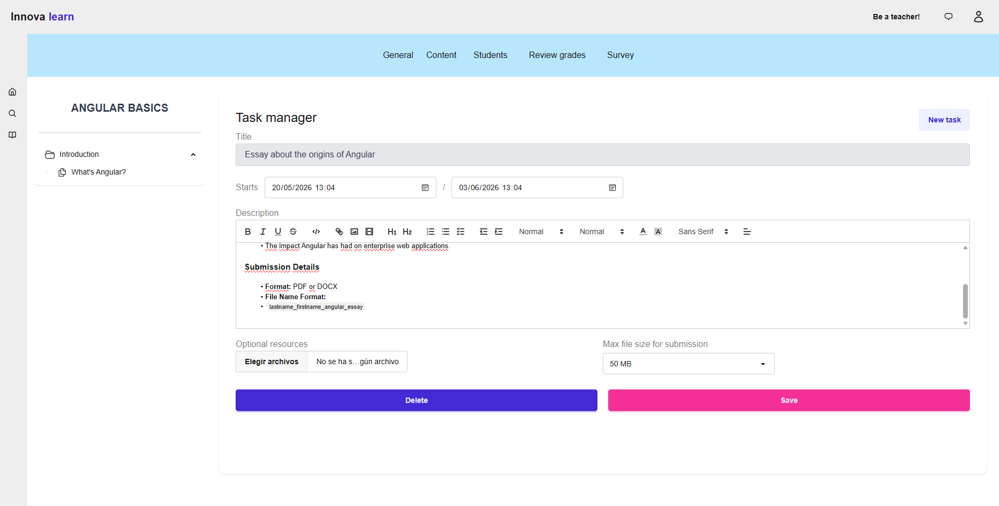
Grading task with pdf visualizer:
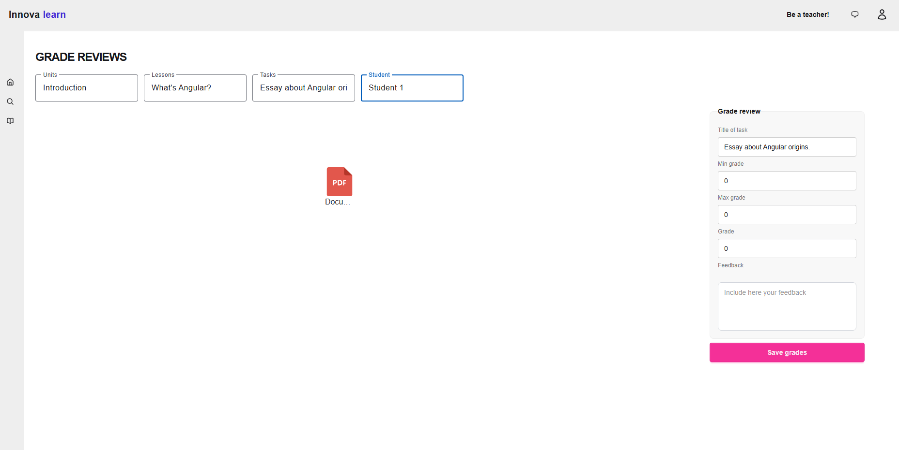
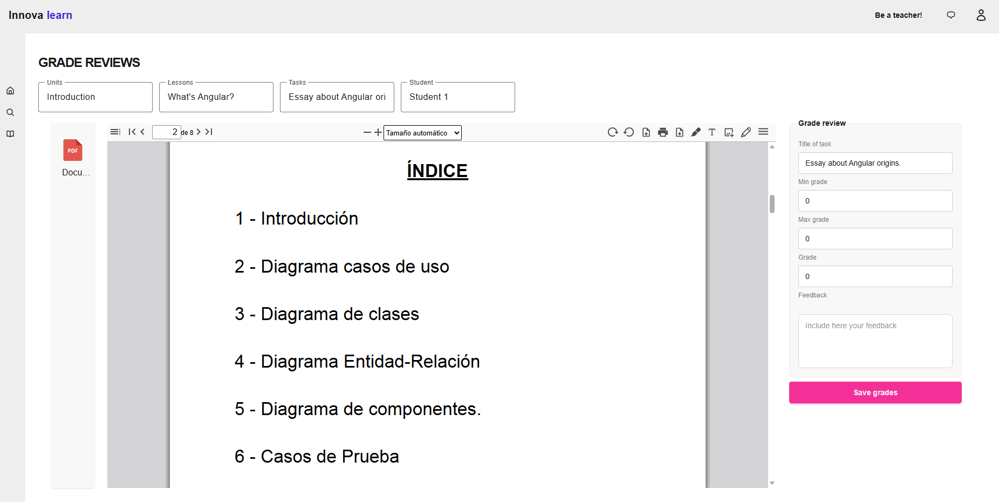
Students explore page:
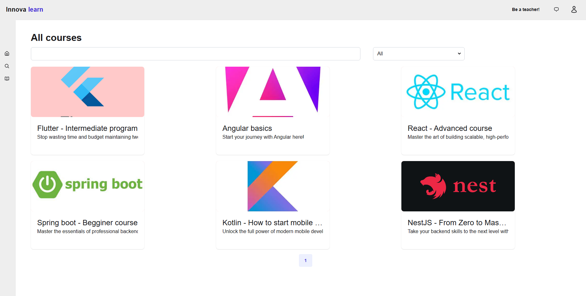
Students course view:
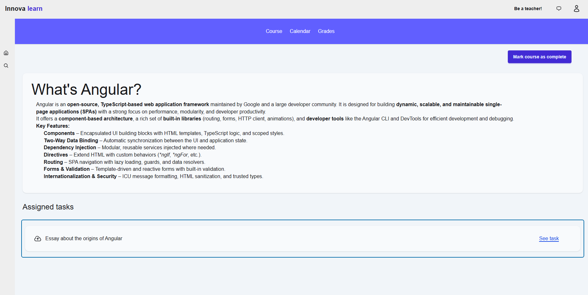
Student submission form:
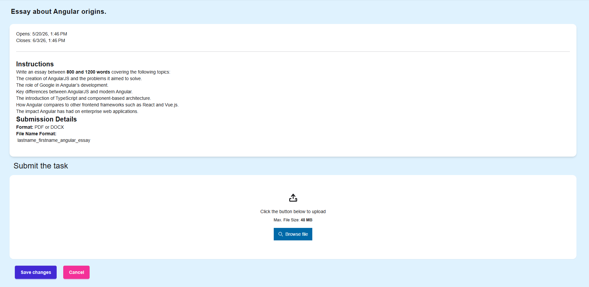
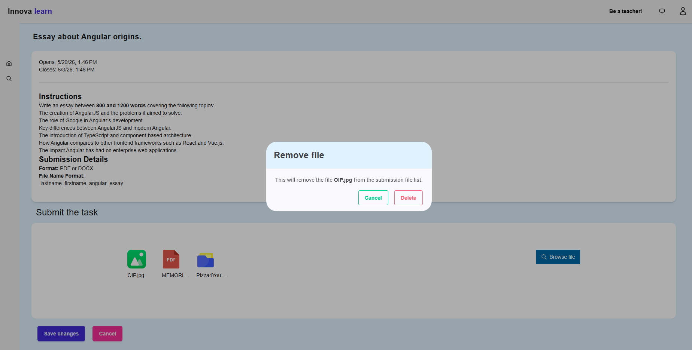
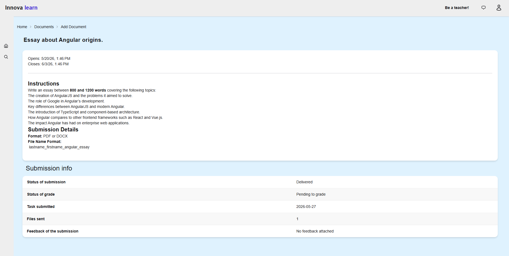
Real-time message service:
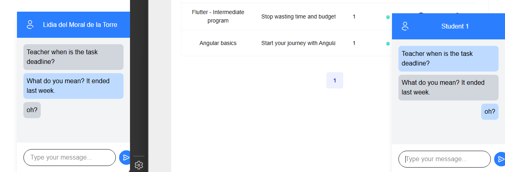

---

# ✨ Features

- **Course management**: Teachers can create and manage courses, units, lessons, and assignments.
- **Assignment review**: Teachers can view and download student submissions. (download work in progress)
- **Explore by categories**: Category-based course discovery system.
- **Rich text editor**: Support for formatted content and embedded videos.
- **Calendar integration**: Unified calendar for active and past assignments.
- **Analytics dashboard**: Visual statistics related to courses and student activity.
- **Real-Time messaging**: Web chat system for online users.

---

# Tech Stack

## Frontend
- TypeScript
- Angular  
- TailwindCSS / SCSS / DaisyUI 


## Communication
- REST API
- WebSockets

## Other libraries used
- Quill editor
- CalendarJS
- PDF Visualizer
---

# Architecture

The frontend follows a modular and component-based architecture focused on scalability and maintainability.

## Main concepts

- Shared reusable UI components
- Centralized state management
- Route-based page structure
- Service abstraction for API communication
- Real-time updates with WebSockets

Structure:

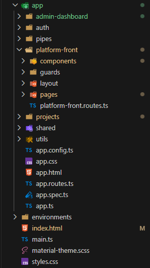


---

#  Project status

Currently in development.

Core functionality has been implemented, but UI/UX improvements, accessibility features, and architectural refinements are still in progress.

---

# 🗺️ Roadmap

- [ ] Improve manager-page state handling
- [ ] Refactor course state management into a dedicated service
- [ ] Add lesson file list component
- [ ] Improve overall UI styling
- [ ] Add dark mode
- [ ] Improve accessibility


---

# 📦 Installation

## 1. Clone the repository

```bash
git clone https://github.com/Lidiadm25/lms-platform.git
cd lms-platform
```

## 2. Install dependencies

```bash
npm install
```

## 3. Configure environment variables

Update the backend API URL in your environment configuration.

Example:

```env
API_URL=http://localhost:3000
```

## 4. Make sure the backend is running

The frontend depends on the backend API being available.

## 5. Run the development server

```bash
npm run start:dev
```

---

# 🔌 Backend repository

You can find the backend repository here:

```md
https://github.com/Lidiadm25/lms-platform-backend
```


